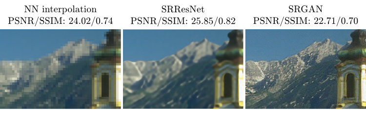
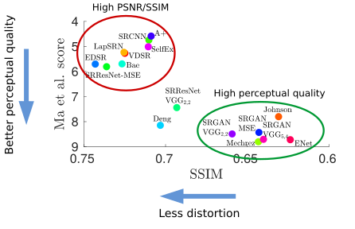
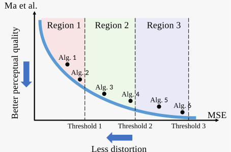

# [PIRM2018 - Workshop and Challenge on  Perceptual Image Restoration  and Manipulation](https://www.pirm2018.org/)

## The Workshop
A key goal in image restoration, manipulation and generation, is to produce images that are visually appealing to human observers. In recent years, there has been great interest as well as significant progress in perceptually-aware computer vision algorithms. However, many works have observed a fundamental disagreement between this recent leap in performance, as evaluated by human observers, and the objective assessment of these methods by common evaluation metrics (e.g. PSNR, SSIM). This workshop will revolve around two main themes: (i) How to design algorithms which satisfy human observers, and (ii) How to evaluate the perceptual quality of such algorithms.

## The Challenges
The PIRM challenges will promote <i>perceptual</i> image restoration. State-of-the-art methods in terms of perceptual quality (e.g. <a href="https://arxiv.org/abs/1609.04802" target="_blank">SRGAN</a>) are rated poorly by "simple" distortion measures such as PSNR and SSIM. Therefore, in contrast to previous challenges, the evaluation and ranking will be done in a perceptual-quality aware manner based on <a href="https://arxiv.org/abs/1711.06077" target="_blank">[Blau and Michaeli, CVPR'18]</a>. This unified approach quantifies the accuracy and perceptual quality of algorithms jointly, and will enable perceptual-driven methods to compete alongside algorithms that target PSNR maximization.<br><br><!-- Prizes will be awarded to the challenge winners. In addition, c--> Challenge participants may submit papers for the ECCV workshop proceedings. Papers will be accepted based on: (i) academic quality, and (ii) challenge ranking.

## [The PIRM challenge on perceptual super resolution](https://www.pirm2018.org/PIRM-SR.html)
Single-image super-resolution has gained much attention in recent years. The appearance of deep neural-net based methods and the great advancement in generative modeling (e.g. GANs) has facilitated a major performance leap. One of the ultimate goals in super-resolution is to produce outputs with high visual quality, as perceived by human observers. However, many works have observed a fundamental disagreement between this recent leap in performance, as quantified by common evaluation metrics (PSNR, SSIM), and the subjective evaluation of human observers (reported e.g. in the <a href="https://arxiv.org/pdf/1609.04802.pdf" target="_blank">SRGAN</a> and <a href="https://arxiv.org/pdf/1612.07919.pdf" target="_blank">EnhanceNet</a> papers).
<div align='center'>
  
</div>
This observation caused the formation of two distinct research directions. The first is aimed at improving the performance according to conventional evaluation metrics (e.g. PSNR), which frequently produce visually unpleasing results. The second, targets high perceptual quality, which commonly performs poorly according to conventional metrics. Previous benchmarks and challenges are mostly relevant for the first line of works.
<div align='center'>
  
</div>
The PIRM-SR challenge will compare and rank <b>perceptual</b> single-image super-resolution. In contrast to previous challenges, the evaluation will be done in a perceptual-quality aware manner based on <a href="https://arxiv.org/pdf/1711.06077.pdf" target="_blank">[Blau and Michaeli, CVPR'18]</a>, and not based solely on distortion measurement (e.g. PSNR/SSIM). This unified approach quantifies the accuracy and perceptual quality of algorithms jointly, and will enable perceptual-driven methods to compete alongside algorithms that target PSNR maximization. <br><br><small>* References for the methods appearing in the figures above can be found in this <a href="https://arxiv.org/pdf/1711.06077.pdf" target="_blank">paper</a>

## Task and Evaluation
### The Task
4x super-resolution of images which were down-sampled with a bicubic kernel.
### Evaluation
The perception-distortion plane will be divided into three regions defined by thresholds on the MSE. In each region, the winning algorithm is the one that achieves the best perceptual quality as quantified by the recent metric of [Ma et al.](https://sites.google.com/site/chaoma99/sr-metric).

<div align='center'>
  
</div>

See [Blau and Michaeli,CVPR'18](https://arxiv.org/abs/1711.06077) for an explanation of the rationale behind this evaluation method.

### Regions
The three regions are defined by:
Region 1: TBD
Region 2: TBD
Region 3: TBD
### Data for evalutaion
Algorithms will be evaluated on a set of 100 images. The validation and self-validation set can be downloaded [here](https://www.pirm2018.org/PIRM-SR.html).
### Submission
Submit your results on the validation set to see your ranking on the leaderboard. After [registering](https://www.pirm2018.org/PIRM-SR.html), you will receive submission instructions. During the validation phase (until July 17<sup>th</sup>), each group is limited to 20 validation submissions in total.
### Self validation
Evaluate your results on your own with the self-validation set and code found in this repository. These are not the validation images, but have an equal distribution of scenes, quality etc.

## Using the Validation Code
This package plots image restoration algorithms on the Perception-Distortion plane, as described in:
"The Perception-Distortion Tradeoff", Yochai Blau and Tomer Michaeli, CVPR, 2018.

### Quick Start
Two Matlab scripts are included:

1) ```plot_your_alg_BSD100_4x.m```:
   Plot your super-resolution algorithm on the Perception-Distortion plane (see figs. 8,10 in
   the paper), along with 16 existing super-resolution algorithms, tested on the BSD100
   dataset after 4x downsampling with a bicubic kernel.

2) ```lot_set_of_algs.m```:
   Plot a set of image restoration algorithms on the Perception-Distortion plane. This script
   can be used for an image restoration task and dataset of your choice.
   * You will need the outputs of all algorithms you wish to plot, as we only supply
   precomputed IQA scores for the scenario described for the first script.

### First step

Before running the scripts, you may need the recompile the MEX files in the matlabPyrTools
toolbox. If so:
1) run ```IQA_algs\matlabPyrTools-master\MEX\compilePyrTools.m```
2) copy the generated MEX files into the parent directory ```IQA_algs\matlabPyrTools-master```

### Contents

The package comprises these main functions

*) ```plot_your_alg_BSD100_4x.m```:

   - Description: Plots your super-resolution algorithm on the Perception-Distortion plane,
        along with 16 existing super-resolution algorithms, tested on the BSD100 dataset after
        4x downsampling with a bicubic kernel. 
   
   - Instructions:
        1) Place the outputs of your algorithm (100 images) in the directory ```Input_BSD100```.
           The file names must match the original file names (see ```utils\BSD100_original```).
        2) Choose a no-reference metric in line 10 of the script.
           Must be one of ```{'Ma','BRISQUE','NIQE'}```. Default is ```'Ma'```.
        3) Run the script.


*) ```plot_set_of_algs.m```:

   - Description: Plot a set of image restoration algorithms on the Perception-Distortion
        plane.
   
   - Instructions:
        1) Place the original "ground truth" images in the 'Input_set_original' directory.
        2) Place the algorithms' outputs in the 'Input_set' directory. Each algorithm's
           outputs should be in a separate subdirectory (the subdirectory name should be
           the algorithm name). The file names in each subdirectory must match the original
           file names.
        2) Choose a no-reference metric in line 10 of the script.
           Must be one of ```{'Ma','BRISQUE','NIQE'}```. Default is ```'NIQE'```.
        3) Run the script.

   - Comments:
        1) The generated plots will accurately depict the Perception-Distortion plane, only
           if the no-reference measure is highly-correlated with human-opinion-scores in the
           tested scenario. The included no-reference scores are suited for the scenario
           used in the first script (see paper for more details). Note that this may not
           be the case for all scenarios / datasets.

### Dependencies

The following packages are included in the ```IQA_algs``` directory, along with the original 
ReadMe and License files:

- No-reference metric for SR by Ma et al.
  Webpage: https://sites.google.com/site/chaoma99/sr-metric
  Citation: "Learning a No-Reference Quality Metric for Single-Image Super-Resolution"
            Chao Ma, Chih-Yuan Yang, Xiaokang Yang, Ming-Hsuan Yang 
            Computer Vision and Image Understanding (CVIU), 2017
- BRISQUE
  Webpage: http://live.ece.utexas.edu/research/Quality/index.htm
  Citation: “No-Reference Image Quality Assessment in the Spatial Domain”
            A. Mittal, A. K. Moorthy and A. C. Bovik, 
            IEEE Transactions on Image Processing , 2012
- NIQE
  Webpage: http://live.ece.utexas.edu/research/Quality/index.htm
  Citation: “Making a Completely Blind Image Quality Analyzer”
            A. Mittal, R. Soundararajan and A. C. Bovik
            IEEE Signal Processing Letters , pp. 209-212, vol. 22, no. 3, March 2013.
- SSIM
  Webpage: https://ece.uwaterloo.ca/~z70wang/research/ssim/index.html
  Citation: "Image quality assessment: From error visibility to structural similarity"
            Z. Wang, A. C. Bovik, H. R. Sheikh and E. P. Simoncelli
            IEEE Transactions on Image Processing, vol. 13, no. 4, pp. 600-612, Apr. 2004.
- MS-SSIM
  Webpage: http://live.ece.utexas.edu/research/Quality/index.htm
  Citation: "Multi-scale structural similarity for image quality assessment"
            Z. Wang, E. P. Simoncelli and A. C. Bovik
            IEEE Asilomar Conference Signals, Systems and Computers , Nov. 2003.
- IFC
  Webpage: http://live.ece.utexas.edu/research/Quality/index.htm
  Citation: "An information fidelity criterion for image quality assessment using natural scene statistics"
            H.R. Sheikh, A.C. Bovik and G. de Veciana
            IEEE Transactions on Image Processing , vol.14, no.12pp. 2117- 2128, Dec. 2005.
- VIF
  Webpage: http://live.ece.utexas.edu/research/Quality/index.htm
  Citation: "Image information and visual quality"
            H.R. Sheikh.and A.C. Bovik
            IEEE Transactions on Image Processing , vol.15, no.2,pp. 430- 444, Feb. 2006.
-matlabPyrTools
  Webpage: https://github.com/LabForComputationalVision/matlabPyrTools
-BSD100 dataset
  Webpage: https://www2.eecs.berkeley.edu/Research/Projects/CS/vision/bsds/
  Citation: "A Database of Human Segmented Natural Images and its Application to Evaluating
            Segmentation Algorithms and Measuring Ecological Statistics"
            D. Martin and C. Fowlkes and D. Tal and J. Malik
            Proc. 8th Int'l Conf. Computer Vision, vol.2, pp. 416-423, Jul. 2001.

### Citation
   
If you use this code in a scientific project, you should cite the following paper in any
resulting publication:

Yochai Blau and Tomer Michaeli, "The Perception-Distortion Tradeoff",
Conference on Computer Vision and Pattern Recognition (CVPR), 2018.

This code is distributed only for academic research purposes.
For other purposes, please contact Tomer Michaeli: tomer.m@ee.technion.ac.il

